# Featured Test Results

## Baseline - no Autoscaling
### 1 Replica Quality 800k
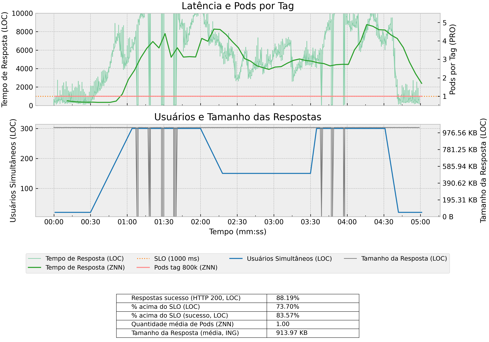

### 3 Replicas Quality 800k
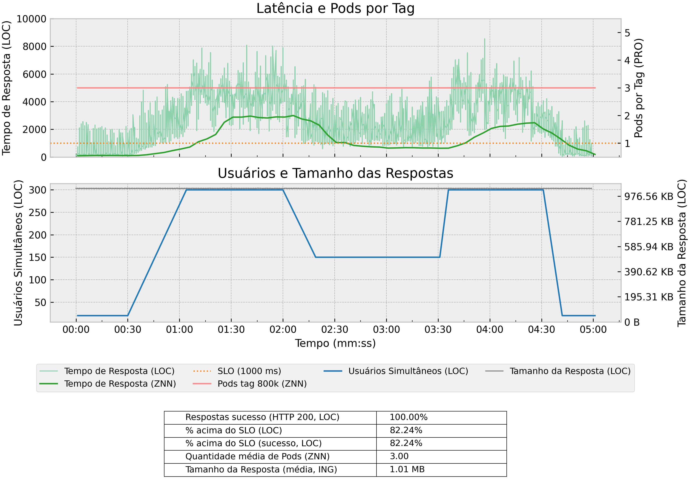

### 5 Replicas Quality 800k
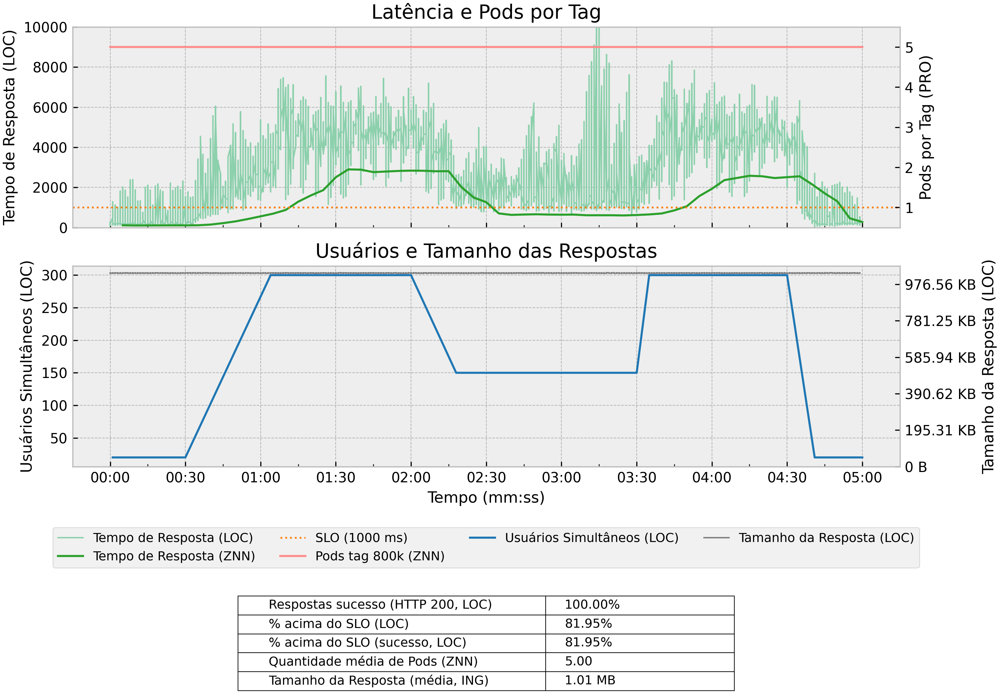

### 1 Replica Quality 400k
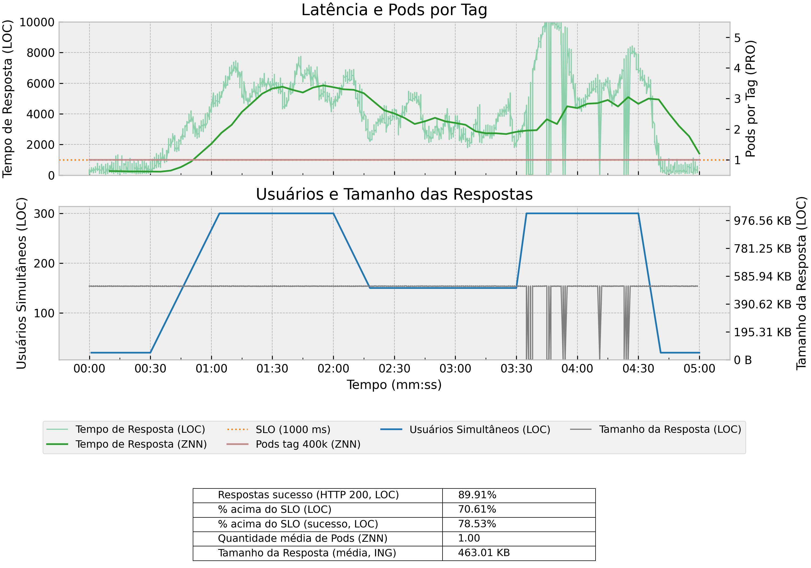

### 3 Replicas Quality 400k
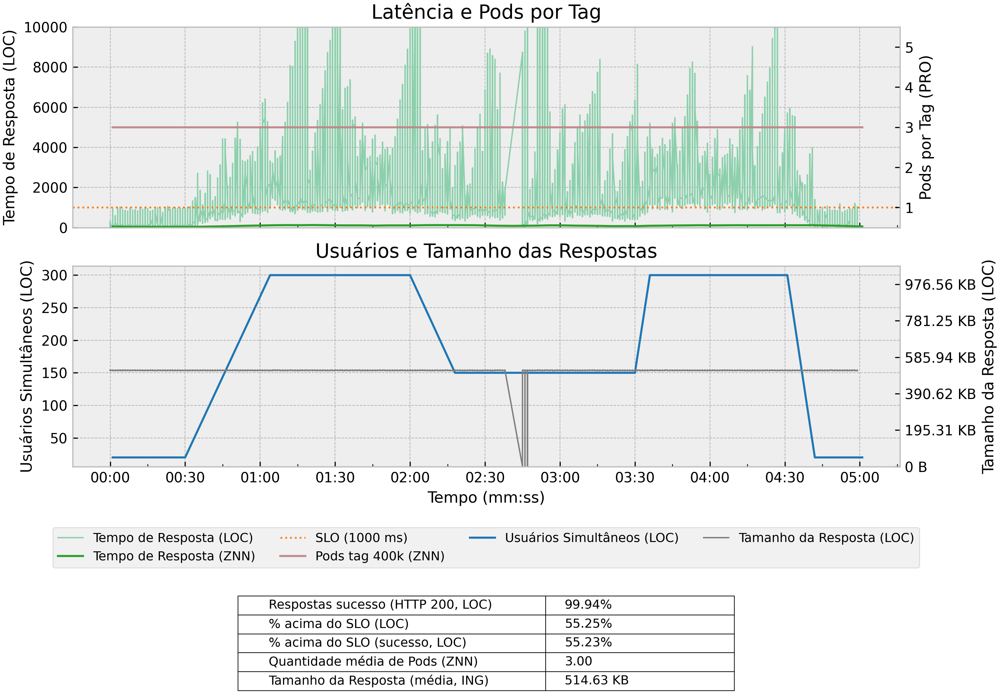

### 5 Replicas Quality 400k
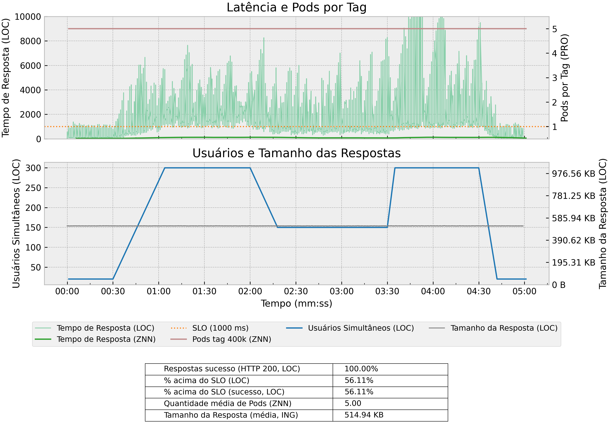

### 1 Replica Quality 200k

### 3 Replicas Quality 200k
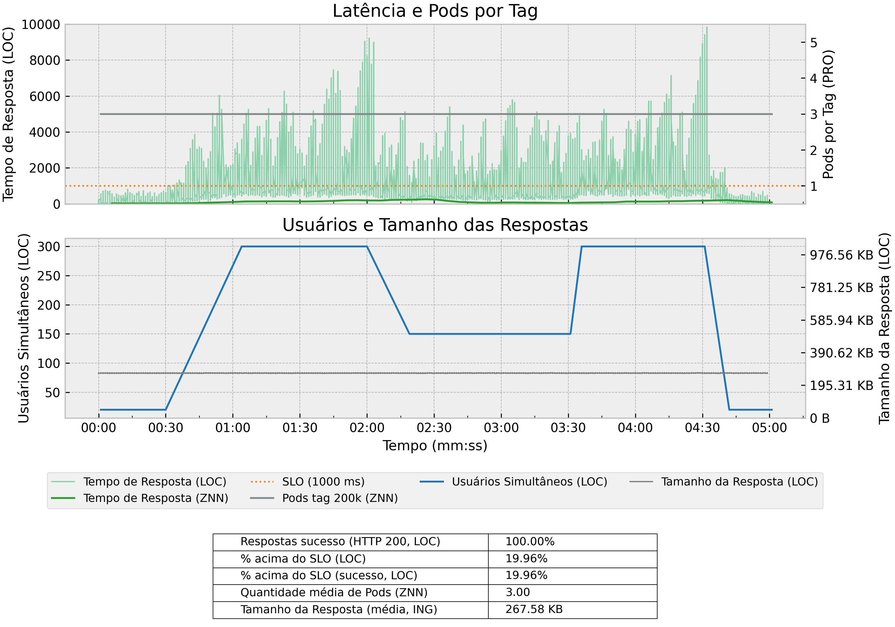

### 5 Replicas Quality 200k

## HPA Default Behavior
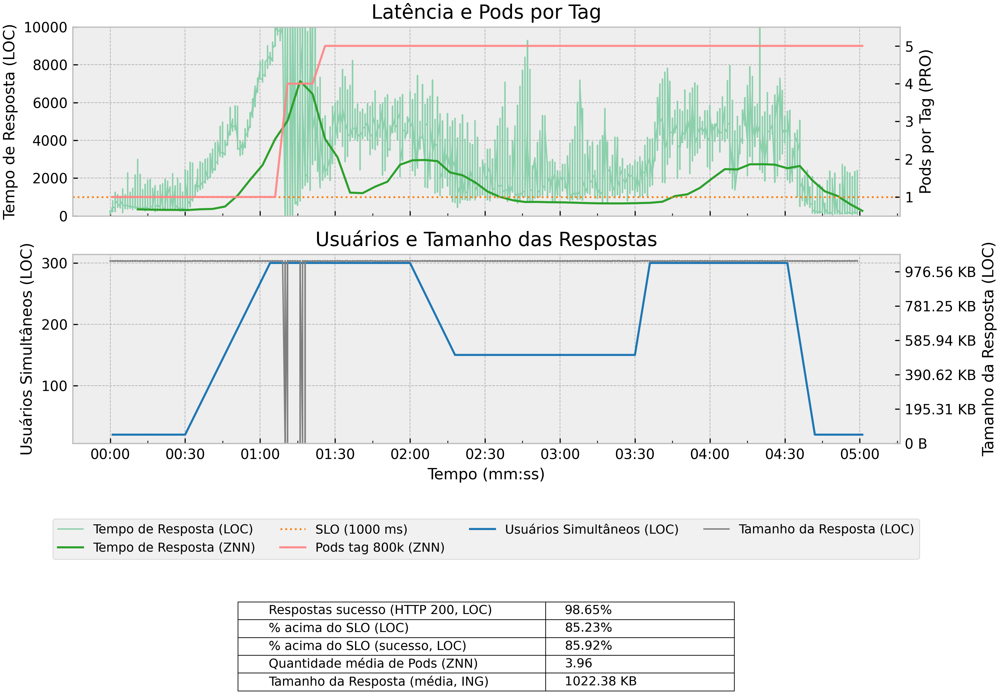

## HPA Behavior fast scaleDown
*stabilizationWindowSeconds=10*
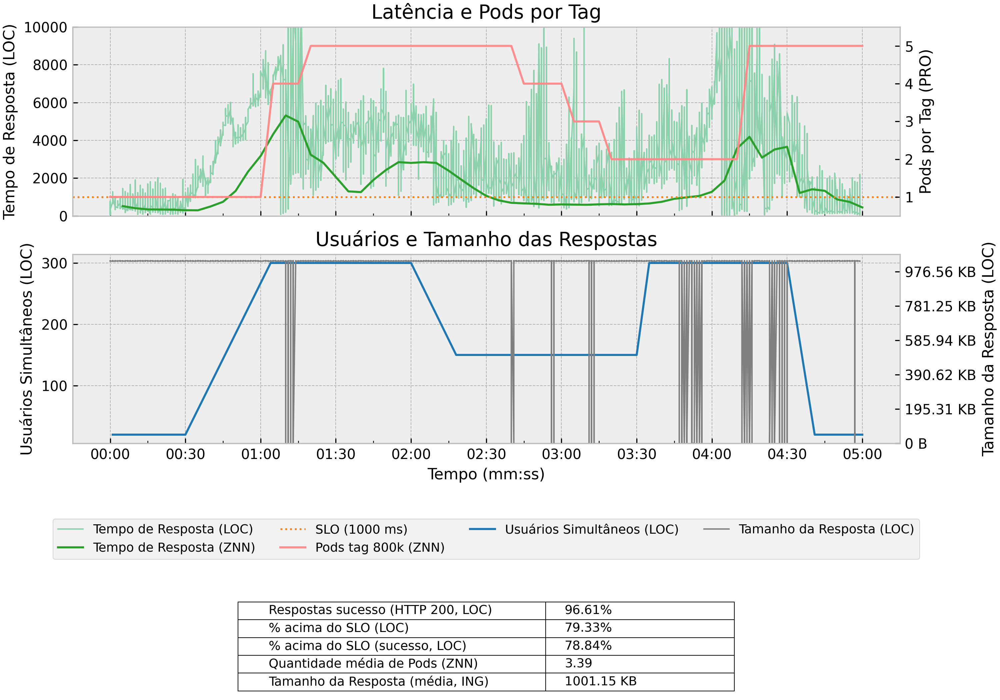

## CSA Horizontal (HPA-like)
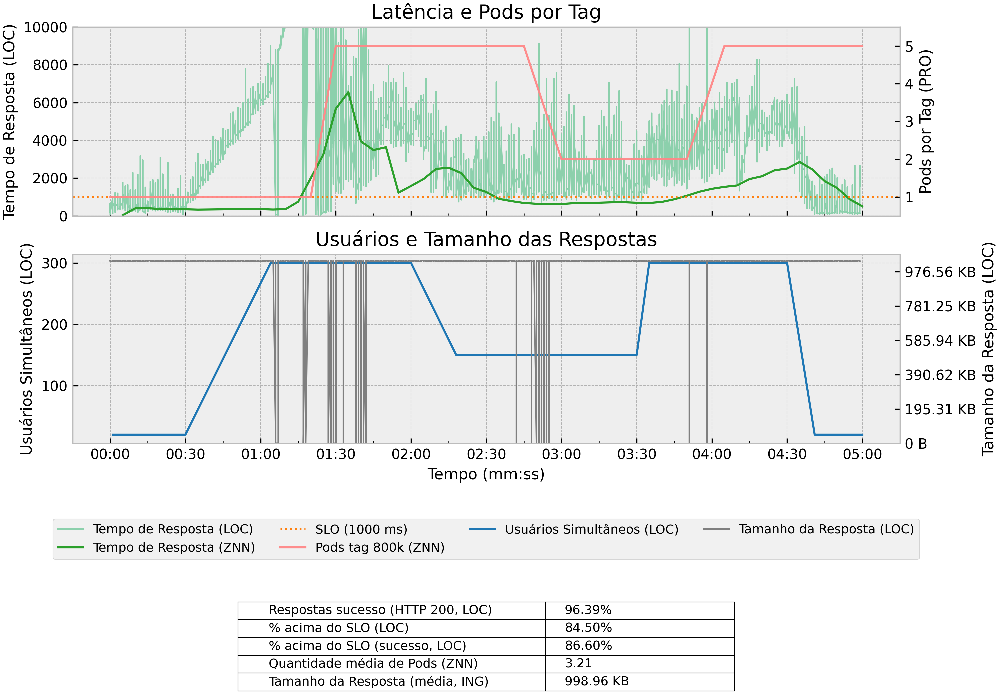

## CSA Horizontal + Quality
### Deployment with maxSurge 25% and maxUnavailable 25%
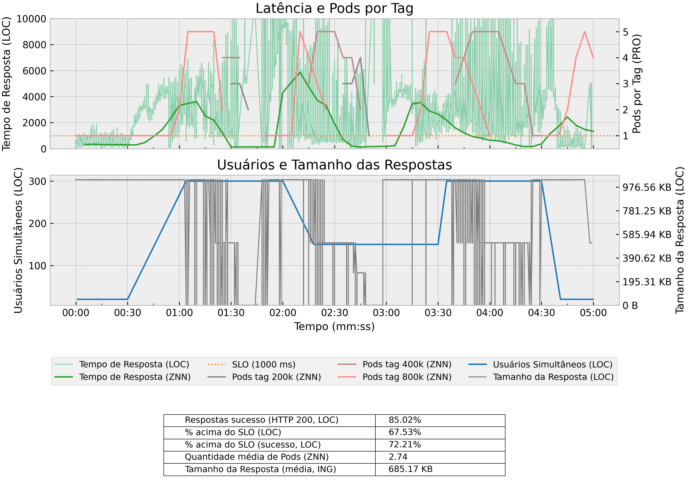

### Deployment with maxSurge 50% and maxUnavailable 50%
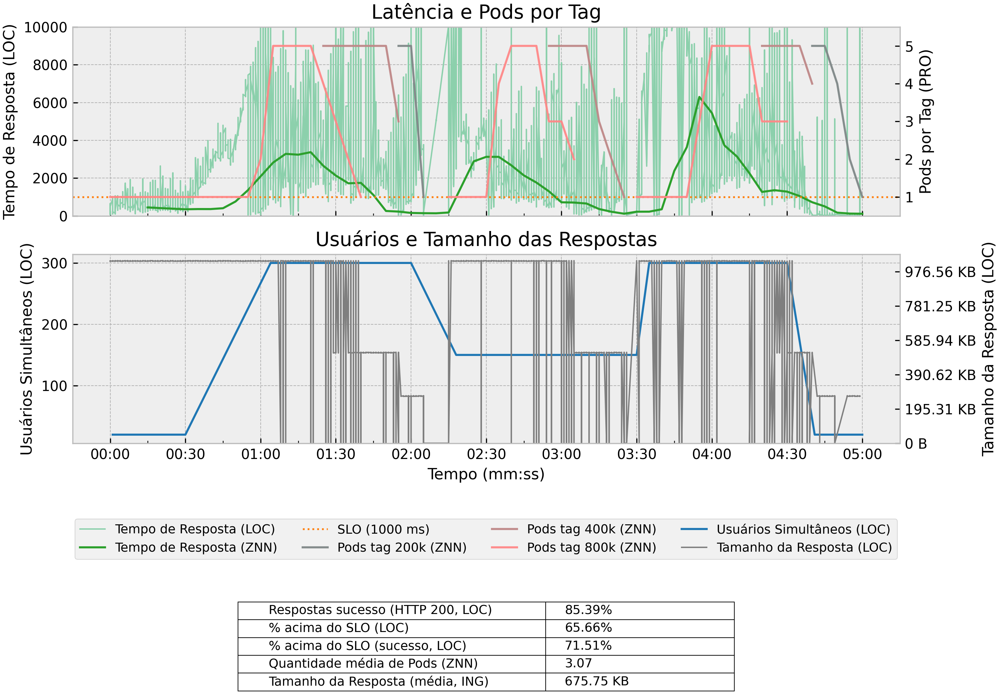

### Deployment with maxSurge 75% and maxUnavailable 75%
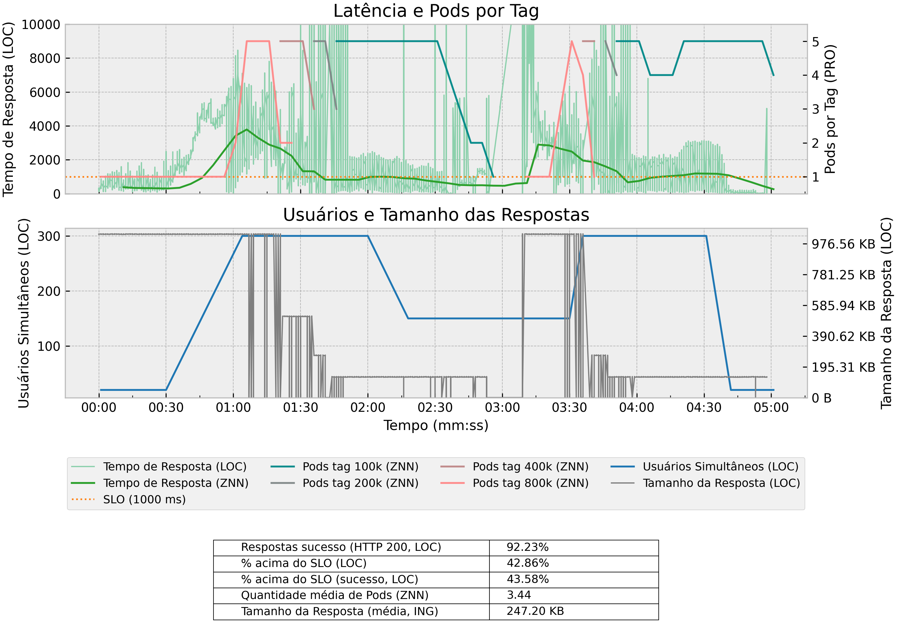

### Deployment with maxSurge 100% and maxUnavailable 100%
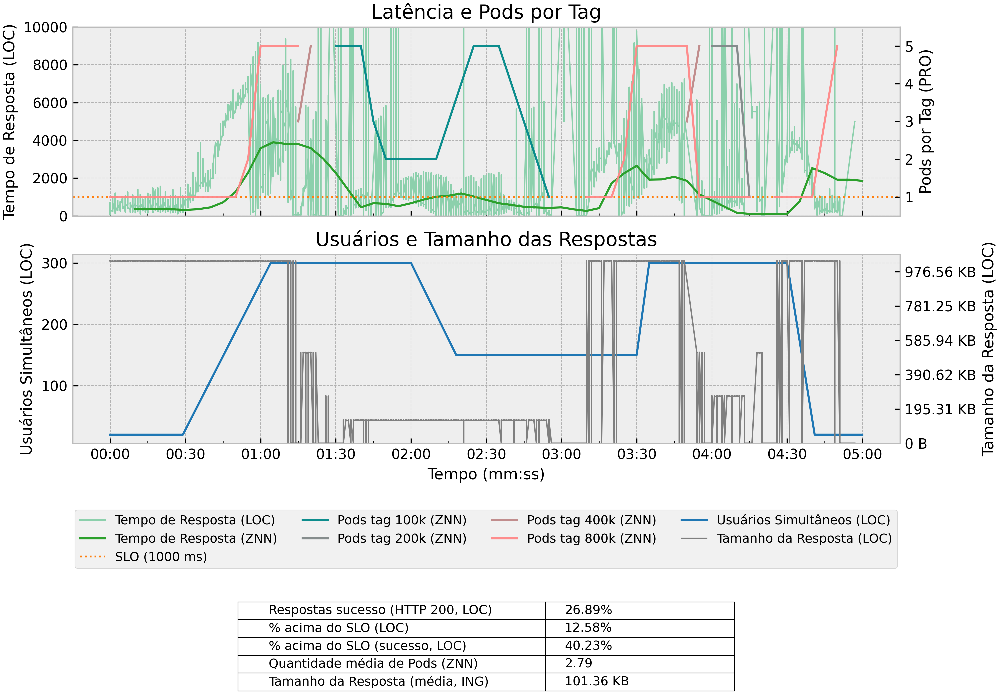
